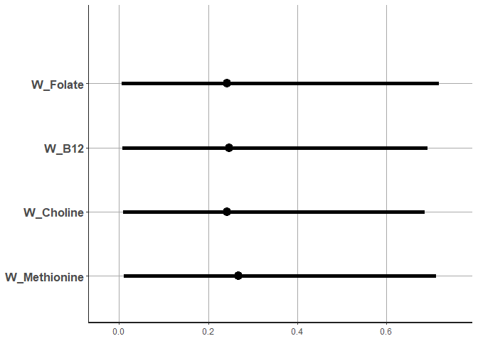

## R Markdown

This is an R Markdown document describing the workflow to analyzing the
mixed effect of methyl-donor nutrients on BW, placental weight and
BW-placental weight ratio in the Cape Town cohort (n=65). Nutrients were
evaluated as either a ‘focused’ group (folate, B12, choline, and
methionine ) or ‘broad’ group (folate, B12, choline, and methionine,
zinc, B6, riboflavin, serine, and glycine). The mixture effect was
evaluated using the bayesian extension of WQS. This extension is
distinct from the traditional WQS model in that it doesn’t require the
internal training (estimation of weights) and validation (using
estimated weights to derive the coefficient for the mixture effect). The
extension also does not require a priori selection of the directionality
of the mixture coefficient and determined confidence intervals for the
weights of the mixture components. Models were adjusted for gestational
age and the log of average daily alcohol exposure during pregnancy. The
strongest borderline association was observed between placental weight
and the broad set of nutrients \[31.2 (-5.78,71.47)\]

## load required libraries

``` r
library(BWQS)
library(MASS)
```

## load the dataset

``` r
Data<-read.csv("Data/cape_ town_fasd_nutrient_data_08032020.csv")
```

## format data

``` r
nutrients_focus <- names(Data)[2:5]
nutrients_broad <-names(Data)[2:10]
```

## bwqs on BW, focused nutrients

``` r
BW_focus_bwqs <-bwqs(birthweight~gestationalage+lgaadxp_2017, mix_name=nutrients_focus,data=Data, q=4, seed=2016)


BW_focus_bwqs$summary_fit
#                      mean se_mean       sd       2.5%     97.5%    n_eff    Rhat
#beta0            -14.88006 2.57334 99.21165 -207.09382 182.53525 1486.383 1.00170
#beta1             26.18513 1.44982 59.50087  -84.57127 146.11780 1684.297 0.99940
#C_gestationalage  77.09019 0.09727  3.73712   69.52725  84.35890 1476.130 1.00102
#C_lgaadxp_2017   -32.27080 2.12234 84.51056 -191.90679 133.14597 1585.594 0.99967
#W_Folate           0.24274 0.00467  0.19430    0.00607   0.71795 1727.484 0.99988
#W_B12              0.24726 0.00465  0.18669    0.00700   0.69228 1608.955 0.99963
#W_Choline          0.24250 0.00472  0.19260    0.00966   0.68821 1666.323 0.99945
#W_Methionine       0.26750 0.00485  0.19730    0.01074   0.71108 1657.625 0.99940
#sigma            480.07484 1.07273 43.58875  406.24671 570.77248 1651.073 0.99940   

bw_weights_focus<-bwqs_plot(BW_focus_bwqs, parms = "W", size = 2)
```

    ## ci_level: 0.95 (95% intervals)

    ## outer_level: 0.95 (95% intervals)

``` r
pdf("Plots/bwqs/bw_weights_focus.pdf")
bw_weights_focus
dev.off()
bw_weights_focus
```

<!-- -->

``` r
bw_coeff_focus<-bwqs_plot(BW_focus_bwqs, parms = c("beta0","beta1",'delta'), size = 2)
```

    ## ci_level: 0.95 (95% intervals)
    ## outer_level: 0.95 (95% intervals)

``` r
pdf("Plots/bwqs/bw_coeff_focus.pdf")
bw_coeff_focus
dev.off()
bw_coeff_focus
```

<!-- -->

## bwqs (PW, focused nutrients)

``` r
PW_focus_bwqs<-bwqs(placentalweight~gestationalage+lgaadxp_2017, mix_name=nutrients_focus,data=Data, q=4, seed=2016)
```

    ## recompiling to avoid crashing R session

``` r
PW_focus_bwqs$summary_fit
#                      mean se_mean       sd       2.5%     97.5%    n_eff    Rhat
#beta0            -10.74088 2.32717 90.27670 -176.63083 167.45158 1504.852 0.99956
#beta1             20.14091 0.47568 16.16286  -11.48852  52.09226 1154.533 1.00243
#C_gestationalage  11.14197 0.06069  2.35346    6.56584  15.58674 1503.584 0.99940
#C_lgaadxp_2017   -52.02633 0.83462 32.96782 -113.41747  14.44411 1560.298 0.99945
#W_Folate           0.20629 0.00411  0.16443    0.00539   0.61539 1598.198 0.99947
#W_B12              0.23812 0.00438  0.17400    0.01097   0.62963 1579.090 0.99941
#W_Choline          0.30015 0.00497  0.20241    0.01333   0.72285 1661.571 0.99946
#W_Methionine       0.25544 0.00455  0.18671    0.00912   0.70311 1681.431 0.99941
#sigma             94.67708 0.22855  8.89533   79.01038 113.39411 1514.881 1.00041

pw_weights_focus<-bwqs_plot(PW_focus_bwqs, parms = "W", size = 2)
```

    ## ci_level: 0.95 (95% intervals)

    ## outer_level: 0.95 (95% intervals)

``` r
pdf("Plots/bwqs/pw_weights_focus.pdf")
pw_weights_focus
dev.off()
pw_weights_focus
```

<!-- -->

``` r
pw_coeff_focus<-bwqs_plot(PW_focus_bwqs, parms = c("beta0","beta1",'delta'), size = 2)
```

    ## ci_level: 0.95 (95% intervals)
    ## outer_level: 0.95 (95% intervals)

``` r
pdf("Plots/bwqs/pw_coeff_focus.pdf")
pw_coeff_focus
dev.off()
pw_coeff_focus
```

<!-- -->

## bwqs (PWBW, focused nutrients)

``` r
PWBW_focus_bwqs<-bwqs(placentabirthweightratio~gestationalage+lgaadxp_2017, mix_name=nutrients_focus,data=Data, q=4, seed=2016)
```

    ## recompiling to avoid crashing R session

``` r
PWBW_focus_bwqs$summary_fit
#beta0             0.25089 0.00154 0.06107  0.13157 0.37445 1562.422 1.00006
#beta1             0.00339 0.00010 0.00420 -0.00511 0.01164 1602.866 1.00029
#C_gestationalage -0.00276 0.00004 0.00156 -0.00589 0.00031 1577.207 1.00017
#C_lgaadxp_2017   -0.01121 0.00021 0.00872 -0.02795 0.00663 1727.944 0.99958
#W_Folate          0.21296 0.00430 0.17663  0.00725 0.64095 1687.924 1.00070
#W_B12             0.24951 0.00500 0.19350  0.00678 0.69608 1500.360 1.00116
#W_Choline         0.31894 0.00534 0.21748  0.01329 0.77645 1658.964 1.00007
#W_Methionine      0.21859 0.00481 0.17282  0.00679 0.61911 1291.333 0.99991
#sigma             0.02419 0.00006 0.00233  0.02024 0.02920 1772.708 1.00031

pwbw_weights_focus<-bwqs_plot(PWBW_focus_bwqs, parms = "W", size = 2)
```

    ## ci_level: 0.95 (95% intervals)

    ## outer_level: 0.95 (95% intervals)

``` r
pdf("Plots/bwqs/pwbw_weights_focus.pdf")
pw_weights_focus
dev.off()
pw_weights_focus
```

<!-- -->

``` r
pwbw_coeff_focus<-bwqs_plot(PWBW_focus_bwqs, parms = c("beta0","beta1",'delta'), size = 2)
```

    ## ci_level: 0.95 (95% intervals)
    ## outer_level: 0.95 (95% intervals)

``` r
pdf("Plots/bwqs/pwbw_coeff_focus.pdf")
pw_coeff_focus
dev.off()
pw_coeff_focus
```

<!-- -->

## bwqs (BW, broad nutrients)

``` r
BW_broad_bwqs <-bwqs(birthweight~gestationalage+lgaadxp_2017, mix_name=nutrients_broad,data=Data, q=4, seed=2016)
```

    ## recompiling to avoid crashing R session

``` r
BW_broad_bwqs$summary_fit
#                      mean se_mean       sd       2.5%     97.5%    n_eff    Rhat
#beta0            -14.02713 2.47629 101.05958 -211.39214 180.94209 1665.528 1.00288
#beta1             63.02048 1.78314  69.13850  -73.73657 191.69654 1503.381 0.99946
#C_gestationalage  75.62856 0.09973   3.93111   68.29522  83.23465 1553.599 0.99991
#C_lgaadxp_2017   -26.45097 2.12962  84.97771 -196.39423 136.77785 1592.235 0.99950
#W_Folate           0.10271 0.00229   0.09010    0.00358   0.33319 1541.468 0.99987
#W_B12              0.10568 0.00224   0.09178    0.00432   0.34680 1684.422 0.99951
#W_Choline          0.10071 0.00254   0.08949    0.00330   0.33274 1242.973 0.99945
#W_Methionine       0.10847 0.00235   0.09592    0.00363   0.33972 1662.158 1.00025
#W_Zinc             0.11050 0.00249   0.09850    0.00320   0.37388 1561.700 0.99945
#W_B6               0.09341 0.00213   0.09077    0.00231   0.33018 1807.798 1.00003
#W_Riboflavin       0.10488 0.00238   0.09098    0.00329   0.33650 1456.722 0.99962
#W_Glycine          0.13420 0.00300   0.11645    0.00444   0.42864 1511.491 0.99956
#W_Serine           0.13945 0.00305   0.11797    0.00409   0.42624 1492.310 0.99940
#sigma            475.23429 1.04926  43.77719  401.15577 574.83207 1740.709 0.99994

bw_weights_broad<-bwqs_plot(BW_broad_bwqs, parms = "W", size = 2)
```

    ## ci_level: 0.95 (95% intervals)

    ## outer_level: 0.95 (95% intervals)

``` r
pdf("Plots/bwqs/bw_weights_broad.pdf")
bw_weights_broad
dev.off()

bw_coeff_broad<-bwqs_plot(BW_broad_bwqs, parms = c("beta0","beta1",'delta'), size = 2)
```

    ## ci_level: 0.95 (95% intervals)
    ## outer_level: 0.95 (95% intervals)

``` r
pdf("Plots/bwqs/bw_coeff_broad.pdf")
bw_coeff_broad
dev.off()
bw_coeff_broad
```

<!-- -->

## bwqs (PW, broad nutrients)

``` r
PW_broad_bwqs<-bwqs(placentalweight~gestationalage+lgaadxp_2017, mix_name=nutrients_broad,data=Data, q=4, seed=2016)
```

    ## recompiling to avoid crashing R session

``` r
PW_broad_bwqs$summary_fit
#                      mean se_mean       sd       2.5%     97.5%    n_eff    Rhat
#beta0            -16.50226 2.32894 93.64391 -203.34019 175.66576 1616.748 0.99956
#beta1             31.18121 0.50436 19.42077   -5.78226  71.46723 1482.714 0.99940
#C_gestationalage  10.85145 0.06684  2.47392    6.10411  15.79045 1369.990 0.99958
#C_lgaadxp_2017   -51.29788 0.80093 32.13032 -114.02100   9.30541 1609.305 0.99943
#W_Folate           0.09387 0.00198  0.08255    0.00242   0.29904 1743.863 0.99952
#W_B12              0.12085 0.00241  0.09882    0.00340   0.36794 1685.359 0.99949
#W_Choline          0.12482 0.00247  0.09976    0.00373   0.36721 1629.551 0.99981
#W_Methionine       0.10323 0.00229  0.09372    0.00259   0.34313 1671.405 0.99990
#W_Zinc             0.09102 0.00205  0.08347    0.00286   0.31100 1658.510 0.99959
#W_B6               0.08830 0.00191  0.07920    0.00250   0.28857 1728.410 0.99941
#W_Riboflavin       0.10544 0.00214  0.08808    0.00342   0.31726 1695.702 0.99984
#W_Glycine          0.12259 0.00247  0.10364    0.00402   0.37553 1762.449 0.99945
#W_Serine           0.14988 0.00288  0.11516    0.00381   0.42299 1597.103 0.99940
#sigma             93.99007 0.21637  8.73048   78.18833 113.35152 1628.139 0.99941

pw_weights_broad<-bwqs_plot(PW_broad_bwqs, parms = "W", size = 2)
```

    ## ci_level: 0.95 (95% intervals)

    ## outer_level: 0.95 (95% intervals)

``` r
pdf("Plots/bwqs/pw_weights_broad.pdf")
pw_weights_broad
dev.off()
pw_weights_broad
```

<!-- -->

``` r
pw_coeff_broad<-bwqs_plot(PW_broad_bwqs, parms = c("beta0","beta1",'delta'), size = 2)
```

    ## ci_level: 0.95 (95% intervals)
    ## outer_level: 0.95 (95% intervals)

``` r
pdf("Plots/bwqs/pw_coeff_broad.pdf")
pw_coeff_broad
dev.off()
pw_coeff_broad
```

<!-- -->

## bwqs (PWBW, broad nutrients)

``` r
PWBW_broad_bwqs<-bwqs(placentabirthweightratio~gestationalage+lgaadxp_2017, mix_name=nutrients_broad,data=Data, q=4, seed=2016)
```

    ## recompiling to avoid crashing R session

``` r
PWBW_broad_bwqs$summary_fit
#        mean se_mean      sd     2.5%   97.5%    n_eff    Rhat
#beta0             0.25207 0.00166 0.06161  0.12124 0.37150 1375.169 0.99949
#beta1             0.00259 0.00014 0.00556 -0.00798 0.01424 1638.534 0.99946
#C_gestationalage -0.00277 0.00004 0.00156 -0.00570 0.00042 1387.920 0.99949
#C_lgaadxp_2017   -0.00984 0.00024 0.00872 -0.02696 0.00799 1338.719 0.99968
#W_Folate          0.10271 0.00233 0.09053  0.00279 0.32930 1512.475 0.99960
#W_B12             0.11324 0.00239 0.09844  0.00293 0.37197 1702.685 1.00019
#W_Choline         0.13277 0.00292 0.11522  0.00313 0.43045 1560.089 1.00014
#W_Methionine      0.10517 0.00245 0.09543  0.00284 0.35868 1518.639 0.99982
#W_Zinc            0.10251 0.00222 0.09232  0.00329 0.35942 1728.165 0.99940
#W_B6              0.11069 0.00236 0.09594  0.00390 0.35192 1654.982 1.00008
#W_Riboflavin      0.11877 0.00242 0.10091  0.00398 0.37122 1744.374 1.00066
#W_Glycine         0.10687 0.00232 0.09592  0.00332 0.35548 1706.563 0.99942
#W_Serine          0.10727 0.00236 0.09862  0.00266 0.35644 1751.420 0.99990
#sigma             0.02438 0.00006 0.00235  0.02032 0.02960 1650.406 0.99987

pwbw_weights_broad<-bwqs_plot(PWBW_broad_bwqs, parms = "W", size = 2)
```

    ## ci_level: 0.95 (95% intervals)

    ## outer_level: 0.95 (95% intervals)

``` r
pdf("Plots/bwqs/pwbw_weights_broad.pdf")
pwbw_weights_broad
dev.off()
pwbw_weights_broad
```

<!-- -->

``` r
pwbw_coeff_plot<-bwqs_plot(PWBW_broad_bwqs, parms = c("beta0","beta1",'delta'), size = 2)
```

    ## ci_level: 0.95 (95% intervals)
    ## outer_level: 0.95 (95% intervals)

``` r
pdf("Plots/bwqs/pwbw_coeff_broad.pdf")
pwbw_coeff_plot
dev.off()
pwbw_coeff_plot
```

<!-- -->
