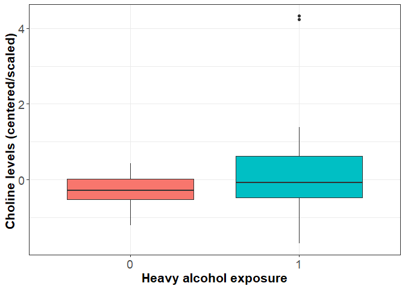

## R Markdown

This is an R Markdown document describing the study characteristics of
the Cape Town cohort nutrient analysis.

## load required libraries

``` r
library(tableone)
library(tidyverse)
```

## load dataset

``` r
Data<-read.csv("Data/cape_ town_fasd_nutrient_data_08032020.csv")
```

## Summary table to nutrient/weight distributions

``` r
myVars <- names(Data)[2:ncol(Data)]
catVars <- c("heavyexpYN")

tab_1 <- CreateTableOne(vars = myVars, data = Data,factorVars = catVars,includeNA=TRUE)
print(tab_1,quote = FALSE, noSpaces = FALSE, showAllLevels=TRUE,missing=TRUE,catDigits=1,contDigits=1,pDigits=2)
```

    ##                                       
    ##                                        level Overall        Missing
    ##   n                                              65                
    ##   Folate (mean (SD))                            0.0 (1.0)   0.0    
    ##   B12 (mean (SD))                              -0.0 (1.0)   0.0    
    ##   Choline (mean (SD))                          -0.0 (1.0)   0.0    
    ##   Methionine (mean (SD))                       -0.0 (1.0)   0.0    
    ##   Zinc (mean (SD))                             -0.0 (1.0)   0.0    
    ##   B6 (mean (SD))                               -0.0 (1.0)   0.0    
    ##   Riboflavin (mean (SD))                       -0.0 (1.0)   0.0    
    ##   Glycine (mean (SD))                           0.0 (1.0)   0.0    
    ##   Serine (mean (SD))                           -0.0 (1.0)   0.0    
    ##   birthweight (mean (SD))                    3023.5 (532.8) 0.0    
    ##   placentalweight (mean (SD))                 439.7 (98.7)  4.6    
    ##   placentabirthweightratio (mean (SD))          0.1 (0.0)   4.6    
    ##   gestationalage (mean (SD))                   39.1 (2.0)   0.0    
    ##   lgaadxp_2017 (mean (SD))                      0.3 (0.4)   0.0    
    ##   AADXP_2017 (mean (SD))                        0.4 (0.6)   0.0    
    ##   AADDXP_2017 (mean (SD))                       2.2 (2.3)   0.0    
    ##   Propddxp_2017 (mean (SD))                     0.1 (0.1)   0.0    
    ##   heavyexpYN (%)                       0         30 (46.2)  0.0    
    ##                                        1         35 (53.8)

``` r
tabMat_1 <- print(tab_1,quote = FALSE, noSpaces = FALSE, showAllLevels=TRUE,printToggle = FALSE,catDigits=1,contDigits=1,pDigits=2)
## Save to a CSV file
write.csv(tabMat_1, file = "Tables/Study_Table1.csv")

tab_2 <- CreateTableOne(vars = myVars, data = Data, strata = "heavyexpYN",factorVars = catVars,includeNA=TRUE)
print(tab_2,quote = FALSE, noSpaces = FALSE, showAllLevels=TRUE,missing=TRUE,catDigits=1,contDigits=1,pDigits=2)
```

    ##                                       Stratified by heavyexpYN
    ##                                        level 0               1              
    ##   n                                              30              35         
    ##   Folate (mean (SD))                            0.0 (1.0)      -0.0 (1.0)   
    ##   B12 (mean (SD))                              -0.2 (0.3)       0.1 (1.3)   
    ##   Choline (mean (SD))                          -0.3 (0.4)       0.2 (1.3)   
    ##   Methionine (mean (SD))                       -0.1 (0.8)       0.1 (1.1)   
    ##   Zinc (mean (SD))                             -0.1 (1.1)       0.1 (0.9)   
    ##   B6 (mean (SD))                                0.0 (1.1)      -0.0 (0.9)   
    ##   Riboflavin (mean (SD))                        0.0 (1.0)      -0.0 (1.0)   
    ##   Glycine (mean (SD))                          -0.1 (1.0)       0.1 (1.0)   
    ##   Serine (mean (SD))                           -0.1 (0.9)       0.1 (1.1)   
    ##   birthweight (mean (SD))                    3126.0 (503.6)  2935.7 (548.6) 
    ##   placentalweight (mean (SD))                 468.2 (97.6)    413.0 (93.4)  
    ##   placentabirthweightratio (mean (SD))          0.1 (0.0)       0.1 (0.0)   
    ##   gestationalage (mean (SD))                   39.3 (1.6)      38.9 (2.3)   
    ##   lgaadxp_2017 (mean (SD))                      0.0 (0.0)       0.5 (0.4)   
    ##   AADXP_2017 (mean (SD))                        0.0 (0.0)       0.8 (0.7)   
    ##   AADDXP_2017 (mean (SD))                       0.1 (0.3)       4.0 (1.6)   
    ##   Propddxp_2017 (mean (SD))                     0.0 (0.0)       0.2 (0.1)   
    ##   heavyexpYN (%)                       0         30 (100.0)       0 (  0.0) 
    ##                                        1          0 (  0.0)      35 (100.0) 
    ##                                       Stratified by heavyexpYN
    ##                                        p     test Missing
    ##   n                                                      
    ##   Folate (mean (SD))                    0.74      0.0    
    ##   B12 (mean (SD))                       0.19      0.0    
    ##   Choline (mean (SD))                   0.04      0.0    
    ##   Methionine (mean (SD))                0.45      0.0    
    ##   Zinc (mean (SD))                      0.59      0.0    
    ##   B6 (mean (SD))                        0.90      0.0    
    ##   Riboflavin (mean (SD))                0.72      0.0    
    ##   Glycine (mean (SD))                   0.29      0.0    
    ##   Serine (mean (SD))                    0.38      0.0    
    ##   birthweight (mean (SD))               0.15      0.0    
    ##   placentalweight (mean (SD))           0.03      4.6    
    ##   placentabirthweightratio (mean (SD))  0.19      4.6    
    ##   gestationalage (mean (SD))            0.35      0.0    
    ##   lgaadxp_2017 (mean (SD))             <0.01      0.0    
    ##   AADXP_2017 (mean (SD))               <0.01      0.0    
    ##   AADDXP_2017 (mean (SD))              <0.01      0.0    
    ##   Propddxp_2017 (mean (SD))            <0.01      0.0    
    ##   heavyexpYN (%)                       <0.01      0.0    
    ## 

``` r
tabMat_2 <- print(tab_2,quote = FALSE, noSpaces = FALSE, showAllLevels=TRUE,printToggle = FALSE,catDigits=1,contDigits=1,pDigits=2)
## Save to a CSV file
write.csv(tabMat_2, file = "Tables/Study_Table2_byAlcoholStatus.csv")

#Nutrients are centered and scaled
#comparing heavily exposed (n=35) and unexposed (n=30), elevated methionine levels are observed in the heavy exposed children.  Placental weight is reduced among heavily exposed children; 
```

## Histogram distribution of nutrients and weight

``` r
CT_hist<-Data%>%
  select(ID,birthweight,placentalweight,placentabirthweightratio, gestationalage,lgaadxp_2017)%>%
  gather(.,key=Variable,value=value,-c(ID))%>%
ggplot(.,aes(value))+
  geom_histogram()+
  theme_bw()+
  theme(axis.title=element_blank(),
        strip.background=element_rect(fill='white'),
        strip.text=element_text(face='bold'))+
 facet_wrap(.~Variable,scales='free')

pdf("Plots/Demo_hist.pdf")
CT_hist
dev.off()

CT_hist
```

<!-- -->

``` r
#range in gestational age spans 31.57 weeks to 44.57 weeks > should these two individuals be excluded from the analysis?  Maybe conduct sensitivity analysis restricted to term infants
```

## Boxplot showing difference in methionine levels and placental weight among heavily exposed and unexposed individuals

``` r
#Methionine by alcohol exposure
met_alc<-ggplot(Data,aes(x=factor(heavyexpYN),y=Methionine,fill=factor(heavyexpYN)))+
  geom_boxplot()+
  theme_bw()+
  labs(x="Heavy alcohol exposure",y="Methionine levels (centered/scaled) ")+
  theme(axis.title=element_text(face="bold",size=16),
        axis.text=element_text(size=14),
        legend.position = "none")
met_alc
```

<!-- -->

``` r
#placental weight by alcohol exposure
pw_alc<-ggplot(Data,aes(x=factor(heavyexpYN),y=placentalweight,fill=factor(heavyexpYN)))+
  geom_boxplot()+
  theme_bw()+
  labs(x="Heavy alcohol exposure",y="Placental weight")+
  theme(axis.title=element_text(face="bold",size=16),
        axis.text=element_text(size=14),
        legend.position = "none")
pw_alc
```

<!-- -->

## PCA

``` r
PCA<-Data[,2:10]

#identify metabolite with 0 variance
which(apply(PCA, 2, var)==0) 
#None

#drop nonvarying
PCA<-PCA[,which(!apply(PCA, 2, var)==0)]

PCA_scores<-prcomp(PCA)
#summary(PCA_pos_scores)
plot(PCA_scores, npcs=4, type="lines")
```

<!-- -->

``` r
pos_scores <- data.frame(ID=Data$ID,PCA_scores$x[,1:3])
pos_scores<-pos_scores%>%
  left_join(Data)

PCA_plot<-ggplot(pos_scores, aes(x=PC1,y=PC2,color=factor(heavyexpYN)),label=ID) +
  geom_point(size=3)+
  theme_bw()+
  theme(axis.title=element_text(size=18,face='bold'),
        axis.text=element_text(size=16))+
  labs(color="Heavy Alcohol Exposure")+
  guides(colour = guide_legend(override.aes = list(size=3,linetype=0)))+
  geom_text(aes(label=ifelse(PC1<(-5),ID,""),hjust=0,vjust=-1),size=6)


pdf("Plots/PCA_nutrients.pdf")
PCA_plot
dev.off()

PCA_plot
```

<!-- -->

``` r
#potentially 2 outliers > remove?
```
