## R Markdown

This is an R Markdown document describing the workflow to analyzing the
mixed effect of methyl-donor nutrients on BW, placental weight and
BW-placental weight ratio in the Cape Town cohort (n=65) using the
standard parameters of the gWQS R package. Nutrients were evaluated as
either a ‘focused’ group (folate, B12, choline, and methionine ) or
‘broad’ group (folate, B12, choline, and methionine, zinc, B6,
riboflavin, serine, and glycine). The mixture effect was evaluated using
the gWQS R package. Models were adjusted for gestational age and the log
of average daily alcohol exposure during pregnancy. No associations were
observed between any of the outcomes and either the focused set or
broader set of nutrients.

## load required libraries

``` r
library(tidyverse)
library(gWQS)
```

## load dataset

``` r
Data<-read.csv("Data/cape_ town_fasd_nutrient_data_08032020.csv")
```

## standard gWQS Birthweight (focused nutrients)

``` r
nutrients_focus <- names(Data)[2:5]
nutrients_broad <-names(Data)[2:10]

BW_focus_std <-gwqs(birthweight~wqs+gestationalage+lgaadxp_2017, data=Data, mix_name = nutrients_focus, b = 100,
b1_pos = TRUE, b1_constr = FALSE, q = 4,
validation = 0.6, rs=FALSE ,family = gaussian, seed=2016)


summary(BW_focus_std)
#            Estimate Std. Error t value Pr(>|t|)    
#wqs              -4.064    101.872  -0.040  0.96841   
#gestationalage  103.139     36.867   2.798  0.00831 **
#lgaadxp_2017    -88.796    209.899  -0.423  0.67485      

gwqs_barplot(BW_focus_std)
```

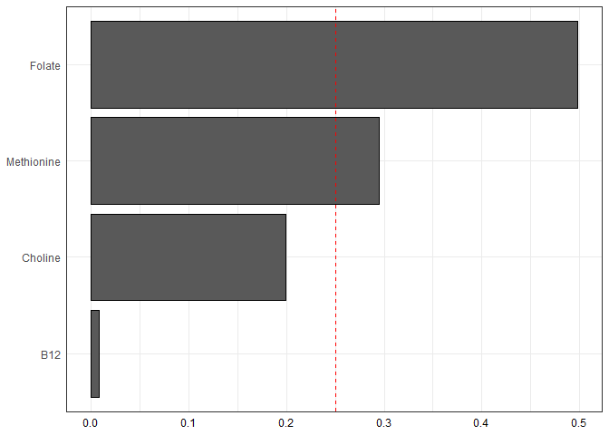<!-- -->

``` r
gwqs_scatterplot(BW_focus_std)
```

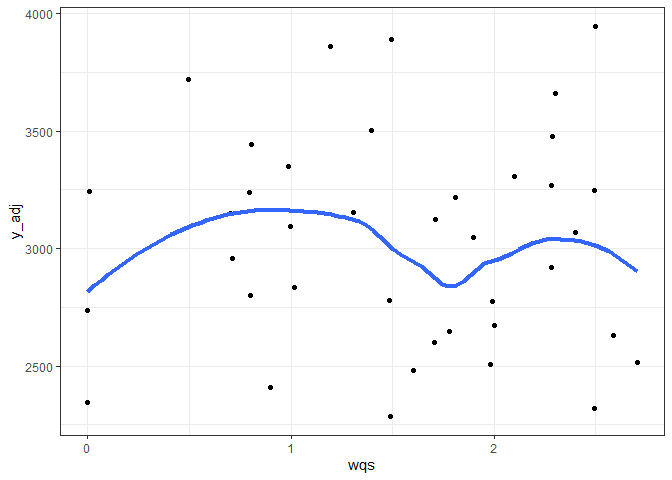<!-- -->

## standard WQS Placenta weight (focused nutrients)

``` r
PW_focus_std<-gwqs(placentalweight~wqs+gestationalage+lgaadxp_2017, data=Data, mix_name = nutrients_focus, b = 100,
b1_pos = TRUE, b1_constr = FALSE, q = 4,
validation = 0.6, rs=FALSE ,family = gaussian, seed=2016)

summary(PW_focus_std)
#            Estimate Std. Error t value Pr(>|t|)    
#(Intercept)    -256.983    298.894  -0.860   0.3961  
#wqs              29.690     21.749   1.365   0.1814  
#gestationalage   17.043      7.722   2.207   0.0344 *
#lgaadxp_2017    -25.657     46.964  -0.546   0.5885

gwqs_barplot(PW_focus_std)
```

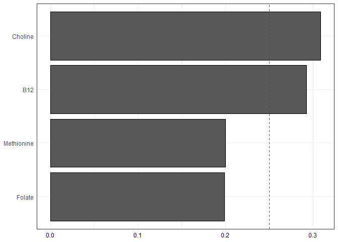<!-- -->

``` r
gwqs_scatterplot(PW_focus_std)
```

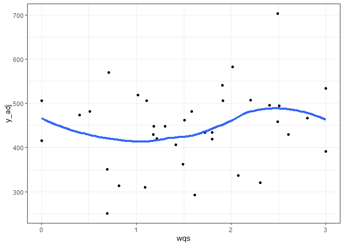<!-- -->

## standard WQS Placenta:Birth weight ratio (focused nutrients)

``` r
PWBW_focus_std<-gwqs(placentabirthweightratio~wqs+gestationalage+lgaadxp_2017, data=Data, mix_name = nutrients_focus, b = 100,
b1_pos = TRUE, b1_constr = FALSE, q = 4,
validation = 0.6, rs=FALSE ,family = gaussian, seed=2016)

summary(PWBW_focus_std)
#                Estimate Std. Error t value Pr(>|t|)   
#(Intercept)     0.225691   0.080506   2.803   0.0084 **
#wqs             0.005027   0.005612   0.896   0.3768   
#gestationalage -0.002245   0.002077  -1.081   0.2876   
#lgaadxp_2017   -0.004373   0.013368  -0.327   0.7456   

gwqs_barplot(PWBW_focus_std)
```

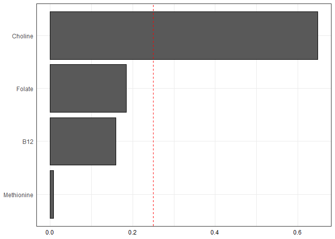<!-- -->

``` r
gwqs_scatterplot(PWBW_focus_std)
```

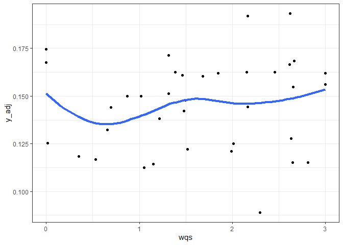<!-- -->

## standard WQS Birth weight (broad nutrients)

``` r
BW_broad_std <-gwqs(birthweight~wqs+gestationalage+lgaadxp_2017, data=Data, mix_name = nutrients_broad, b = 100,
b1_pos = TRUE, b1_constr = FALSE, q = 4,
validation = 0.6, rs=FALSE ,family = gaussian, seed=2016)

summary(BW_broad_std)
#               Estimate Std. Error t value Pr(>|t|)   
#(Intercept)    -1006.17    1458.44  -0.690  0.49481   
#wqs               19.81     127.83   0.155  0.87775   
#gestationalage   103.35      36.84   2.805  0.00815 **
#lgaadxp_2017     -91.40     208.03  -0.439  0.66310 

gwqs_barplot(BW_broad_std)
```

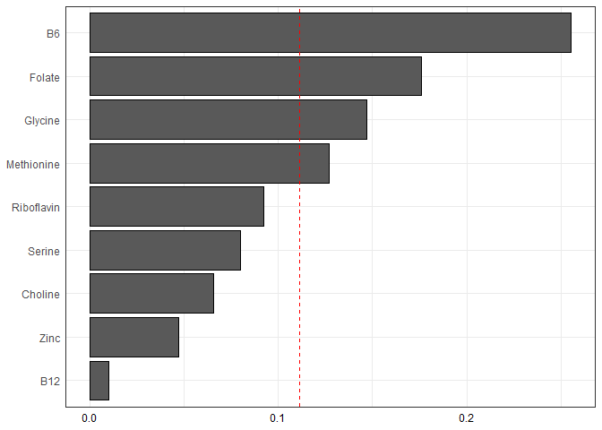<!-- -->

``` r
gwqs_scatterplot(BW_broad_std)
```

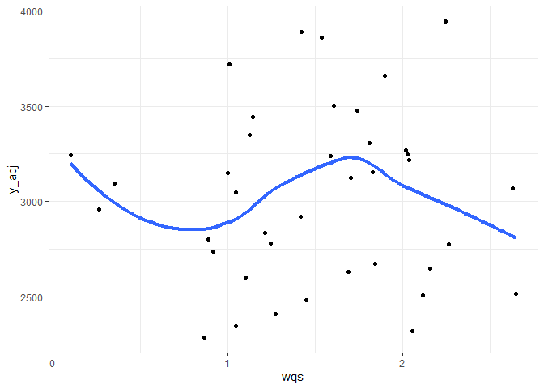<!-- -->

## standard WQS Placenta weight (broad nutrients)

``` r
PW_broad_std<-gwqs(placentalweight~wqs+gestationalage+lgaadxp_2017, data=Data, mix_name = nutrients_broad, b = 100,
b1_pos = TRUE, b1_constr = FALSE, q = 4,
validation = 0.6, rs=FALSE ,family = gaussian, seed=2016)

summary(PW_broad_std)
#               Estimate Std. Error t value Pr(>|t|)  
#(Intercept)    -237.461    299.350  -0.793   0.4333  
#wqs              35.422     24.469   1.448   0.1572  
#gestationalage   16.215      7.808   2.077   0.0457 *
#lgaadxp_2017    -14.543     43.283  -0.336   0.7390  

gwqs_barplot(PW_broad_std)
```

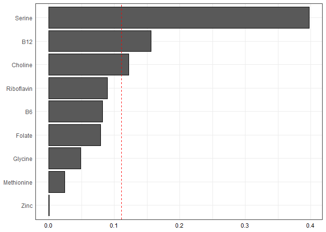<!-- -->

``` r
gwqs_scatterplot(PW_broad_std)
```

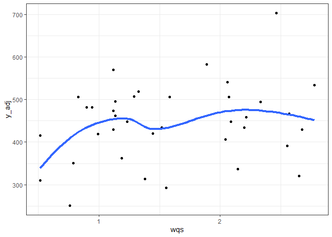<!-- -->

## Placenta:Birth weight ratio (broad nutrients)

``` r
PWBW_broad_std<-gwqs(placentabirthweightratio~wqs+gestationalage+lgaadxp_2017, data=Data, mix_name = nutrients_broad, b = 100,
b1_pos = TRUE, b1_constr = FALSE, q = 4,
validation = 0.6, rs=FALSE ,family = gaussian, seed=2016)

summary(PWBW_broad_std)
#                Estimate Std. Error t value Pr(>|t|)   
#(Intercept)     0.224707   0.080652   2.786  0.00877 **
#wqs             0.005638   0.006986   0.807  0.42543   
#gestationalage -0.002259   0.002094  -1.079  0.28847   
#lgaadxp_2017   -0.001921   0.012298  -0.156  0.87682 

gwqs_barplot(PWBW_broad_std)
```

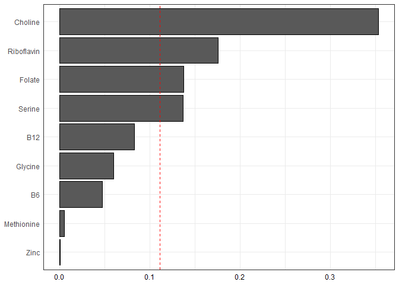<!-- -->

``` r
gwqs_scatterplot(PWBW_broad_std)
```

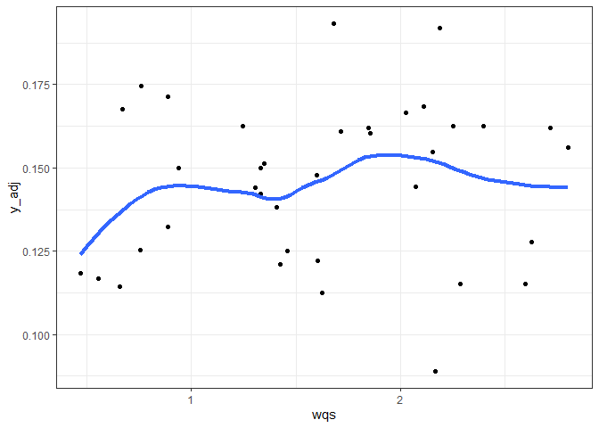<!-- -->
