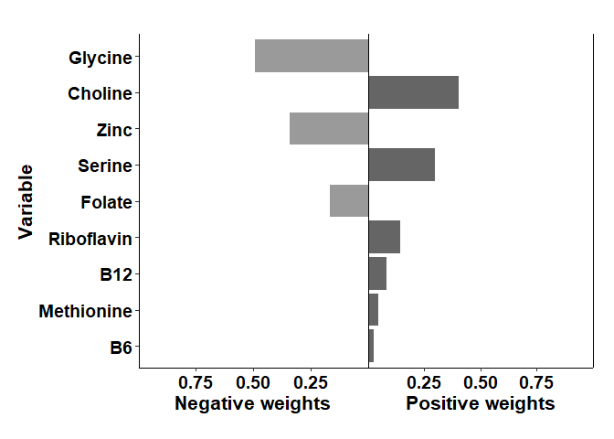

## R Markdown

This is an R Markdown document describing the workflow to analyze the
mixed effect of methyl-donor nutrients on BW, placental weight and
BW-placental weight ratio in the Cape Town cohort (n=65). Nutrients were
evaluated as either a ‘focused’ group (folate, B12, choline, and
methionine ) or ‘broad’ group (folate, B12, choline, and methionine,
zinc, B6, riboflavin, serine, and glycine). The mixture effect was
evaluated using the qgcomp R package. This extension is distinct from
the traditional WQS model in that it doesn’t require the internal
training (estimation of weights) and validation (using estimated weights
to derive the coefficient for the mixture effect). The extension also
does not require a priori selection of the directionality of the mixture
coefficient and determined confidence intervals for the weights of the
mixture components. Models were adjusted for gestational age and the log
of average daily alcohol exposure during pregnancy. A borderline mixed
effect was observed between placental weight and the broader set of
nutrients (p=0.06), driven mainly by serine.

\#\#load required libraries

``` r
library(qgcomp)
library(tidyverse)
```

\#\#load the dataset

``` r
Data<-read.csv("Data/cape_ town_fasd_nutrient_data_08032020.csv")
```

\#\#format data

``` r
nutrients_focus <- names(Data)[2:5]
nutrients_broad <-names(Data)[2:10]

covars<-c('gestationalage','lgaadxp_2017')
```

\#\#Run qgcomp (BW, focused nutrients)

``` r
BW_focus_bwqs_qgcomp<-qgcomp.noboot(birthweight ~ gestationalage+ lgaadxp_2017 + Folate + B12 + Choline + Methionine, expnms=nutrients_focus, data=Data, family=gaussian(), q=4)

BW_focus_bwqs_qgcomp
```

    ## Scaled effect size (positive direction, sum of positive coefficients = 73.5)
    ## Methionine     Folate    Choline 
    ##     0.8773     0.0988     0.0239 
    ## 
    ## Scaled effect size (negative direction, sum of negative coefficients = -1.77)
    ## B12 
    ##   1 
    ## 
    ## Mixture slope parameters (Delta method CI):
    ## 
    ##              Estimate Std. Error  Lower CI Upper CI t value Pr(>|z|)
    ## (Intercept) -2450.651   1188.358 -4779.791  -121.51 -2.0622  0.04353
    ## psi1           71.765     81.994   -88.941   232.47  0.8752  0.38493

``` r
#Scaled effect size (positive direction, sum of positive coefficients = 73.5)
#Methionine     Folate    Choline 
#    0.8773     0.0988     0.0239 

#Scaled effect size (negative direction, sum of negative coefficients = -1.77)
#B12 
#  1 

#Mixture slope parameters (Delta method CI):
#             Estimate Std. Error  Lower CI Upper CI t value Pr(>|z|)
#(Intercept) -2450.651   1188.358 -4779.791  -121.51 -2.0622  0.04353
#psi1           71.765     81.994   -88.941   232.47  0.8752  0.38493

pdf("Plots/qgcomp/bw_focus_weights.pdf")
plot(BW_focus_bwqs_qgcomp)
dev.off()
```

    ## png 
    ##   2

``` r
BW_focus_bwqs_qgcomp_boot<-qgcomp.boot(birthweight ~ gestationalage+ lgaadxp_2017 + Folate + B12 + Choline + Methionine, expnms=nutrients_focus, data=Data, family=gaussian(), q=4,B=500,seed=2016)

pdf("Plots/qgcomp/bw_focus_fit.pdf")
plot(BW_focus_bwqs_qgcomp_boot, pointwiseref = 3)
dev.off()
```

    ## png 
    ##   2

``` r
pointwisebound.boot(BW_focus_bwqs_qgcomp_boot, pointwiseref=3)
```

    ##   quantile quantile.midpoint y.expected  mean.diff   se.diff    ul.pw    ll.pw
    ## 0        0             0.125   2917.548 -143.52906 167.42618 3245.697 2589.398
    ## 1        1             0.375   2989.312  -71.76453  83.71309 3153.387 2825.238
    ## 2        2             0.625   3061.077    0.00000   0.00000 3061.077 3061.077
    ## 3        3             0.875   3132.841   71.76453  83.71309 3296.916 2968.767

``` r
#  quantile quantile.midpoint y.expected  mean.diff   se.diff    ul.pw    ll.pw
#0        0             0.125   2917.548 -143.52906 167.42618 3245.697 2589.398
#1        1             0.375   2989.312  -71.76453  83.71309 3153.387 2825.238
#2        2             0.625   3061.077    0.00000   0.00000 3061.077 3061.077
#3        3             0.875   3132.841   71.76453  83.71309 3296.916 2968.767
qgcomp:::modelbound.boot(BW_focus_bwqs_qgcomp_boot)
```

    ##   quantile quantile.midpoint y.expected     se.pw    ll.pw    ul.pw ll.simul
    ## 0        0             0.125   2917.548 147.89818 2627.673 3207.423 2592.550
    ## 1        1             0.375   2989.312  83.35193 2825.946 3152.679 2796.138
    ## 2        2             0.625   3061.077  77.69799 2908.792 3213.362 2882.390
    ## 3        3             0.875   3132.841 138.35525 2861.670 3404.013 2818.843
    ##   ul.simul
    ## 0 3247.935
    ## 1 3189.621
    ## 2 3230.678
    ## 3 3444.986

``` r
#  quantile quantile.midpoint y.expected     se.pw    ll.pw    ul.pw ll.simul ul.simul
#0        0             0.125   2917.548 147.89818 2627.673 3207.423 2592.550 3247.935
#1        1             0.375   2989.312  83.35193 2825.946 3152.679 2796.138 3189.621
#2        2             0.625   3061.077  77.69799 2908.792 3213.362 2882.390 3230.678
#3        3             0.875   3132.841 138.35525 2861.670 3404.013 2818.843 3444.986
```

\#\#Run qgcomp (PW, focused nutrients)

``` r
PW_focus_bwqs_qgcomp<-qgcomp.noboot(placentalweight ~ gestationalage+ lgaadxp_2017 + Folate + B12 + Choline + Methionine, expnms=nutrients_focus, data=Data, family=gaussian(), q=4)

PW_focus_bwqs_qgcomp
```

    ## Scaled effect size (positive direction, sum of positive coefficients = 30.1)
    ##    Choline Methionine        B12     Folate 
    ##      0.496      0.332      0.127      0.046 
    ## 
    ## Scaled effect size (negative direction, sum of negative coefficients = 0)
    ## None
    ## 
    ## Mixture slope parameters (Delta method CI):
    ## 
    ##             Estimate Std. Error  Lower CI Upper CI t value Pr(>|z|)
    ## (Intercept)  -85.329    243.939 -563.4415  392.783 -0.3498  0.72778
    ## psi1          30.078     17.145   -3.5253   63.681  1.7543  0.08475

``` r
#Scaled effect size (positive direction, sum of positive coefficients = 30.1)
#   Choline Methionine        B12     Folate 
#     0.496      0.332      0.127      0.046 

#Scaled effect size (negative direction, sum of negative coefficients = 0)
#None

#Mixture slope parameters (Delta method CI):

#            Estimate Std. Error  Lower CI Upper CI t value Pr(>|z|)
#(Intercept)  -85.329    243.939 -563.4415  392.783 -0.3498  0.72778
#psi1          30.078     17.145   -3.5253   63.681  1.7543  0.08475

pdf("Plots/qgcomp/pw_focus_weights.pdf")
plot(PW_focus_bwqs_qgcomp)
dev.off()
```

    ## png 
    ##   2

``` r
plot(PW_focus_bwqs_qgcomp)
```

<!-- -->

``` r
PW_focus_bwqs_qgcomp_boot<-qgcomp.boot(placentalweight ~ gestationalage+ lgaadxp_2017 + Folate + B12 + Choline + Methionine, expnms=nutrients_focus, data=Data[complete.cases(Data$placentalweight),], family=gaussian(), q=4,B=500,seed=2016)

pdf("Plots/qgcomp/pw_focus_fit.pdf")
plot(PW_focus_bwqs_qgcomp_boot, pointwiseref = 3)
dev.off()
```

    ## png 
    ##   2

``` r
plot(PW_focus_bwqs_qgcomp_boot, pointwiseref = 3)
```

<!-- -->

``` r
pointwisebound.boot(PW_focus_bwqs_qgcomp_boot, pointwiseref=3)
```

    ##   quantile quantile.midpoint y.expected mean.diff  se.diff    ul.pw    ll.pw
    ## 0        0             0.125   402.7435 -49.24517 34.80386 470.9579 334.5292
    ## 1        1             0.375   427.3661 -24.62258 17.40193 461.4733 393.2590
    ## 2        2             0.625   451.9887   0.00000  0.00000 451.9887 451.9887
    ## 3        3             0.875   476.6113  24.62258 17.40193 510.7185 442.5041

``` r
#  quantile quantile.midpoint y.expected mean.diff  se.diff    ul.pw    ll.pw
#0        0             0.125   402.7435 -49.24517 34.80386 470.9579 334.5292
#1        1             0.375   427.3661 -24.62258 17.40193 461.4733 393.2590
#2        2             0.625   451.9887   0.00000  0.00000 451.9887 451.9887
#3        3             0.875   476.6113  24.62258 17.40193 510.7185 442.5041
qgcomp:::modelbound.boot(PW_focus_bwqs_qgcomp_boot)
```

    ##   quantile quantile.midpoint y.expected    se.pw    ll.pw    ul.pw ll.simul
    ## 0        0             0.125   402.7435 28.48369 346.9165 458.5705 333.9957
    ## 1        1             0.375   427.3661 14.84673 398.2671 456.4652 391.3868
    ## 2        2             0.625   451.9887 15.33573 421.9312 482.0462 418.4531
    ## 3        3             0.875   476.6113 29.25061 419.2812 533.9414 407.3023
    ##   ul.simul
    ## 0 465.0237
    ## 1 460.9046
    ## 2 487.9197
    ## 3 540.3738

``` r
#  quantile quantile.midpoint y.expected    se.pw    ll.pw    ul.pw ll.simul ul.simul
#0        0             0.125   402.7435 28.48369 346.9165 458.5705 333.9957 465.0237
#1        1             0.375   427.3661 14.84673 398.2671 456.4652 391.3868 460.9046
#2        2             0.625   451.9887 15.33573 421.9312 482.0462 418.4531 487.9197
#3        3             0.875   476.6113 29.25061 419.2812 533.9414 407.3023 540.3738
```

\#\#Run qgcomp (PWBW, focused nutrients)

``` r
PWBW_focus_bwqs_qgcomp<-qgcomp.noboot(placentabirthweightratio ~ gestationalage+ lgaadxp_2017 + Folate + B12 + Choline + Methionine, expnms=nutrients_focus, data=Data[complete.cases(Data$placentabirthweightratio),], family=gaussian(), q=4)

PWBW_focus_bwqs_qgcomp
```

    ## Scaled effect size (positive direction, sum of positive coefficients = 0.00711)
    ## Choline     B12 
    ##   0.778   0.222 
    ## 
    ## Scaled effect size (negative direction, sum of negative coefficients = -0.00391)
    ##     Folate Methionine 
    ##      0.598      0.402 
    ## 
    ## Mixture slope parameters (Delta method CI):
    ## 
    ##              Estimate Std. Error  Lower CI Upper CI t value  Pr(>|z|)
    ## (Intercept) 0.2674570  0.0607827  0.148325 0.386589  4.4002 4.797e-05
    ## psi1        0.0031999  0.0043485 -0.005323 0.011723  0.7359    0.4648

``` r
#Scaled effect size (positive direction, sum of positive coefficients = 30.1)
#Choline     B12 
#  0.778   0.222

#Scaled effect size (negative direction, sum of negative coefficients = 0)
#Folate Methionine 
#0.598      0.402 

#Mixture slope parameters (Delta method CI):

#            Estimate Std. Error  Lower CI Upper CI t value Pr(>|z|)
#(Intercept) 0.2674570  0.0607827  0.148325 0.386589  4.4002 4.797e-05
#psi1        0.0031999  0.0043485 -0.005323 0.011723  0.7359    0.4648

pdf("Plots/qgcomp/pwbw_focus_weights.pdf")
plot(PWBW_focus_bwqs_qgcomp)
dev.off()
```

    ## png 
    ##   2

``` r
plot(PW_focus_bwqs_qgcomp_boot, pointwiseref = 3)
```

<!-- -->

``` r
PWBW_focus_bwqs_qgcomp_boot<-qgcomp.boot(placentabirthweightratio ~ gestationalage+ lgaadxp_2017 + Folate + B12 + Choline + Methionine, expnms=nutrients_focus, data=Data[complete.cases(Data$placentabirthweightratio),], family=gaussian(), q=4,B=500,seed=2016)

pdf("Plots/qgcomp/pwbw_focus_fit.pdf")
plot(PWBW_focus_bwqs_qgcomp_boot, pointwiseref = 3)
dev.off()
```

    ## png 
    ##   2

``` r
plot(PWBW_focus_bwqs_qgcomp_boot, pointwiseref = 3)
```

<!-- -->

``` r
pointwisebound.boot(PWBW_focus_bwqs_qgcomp_boot, pointwiseref=3)
```

    ##   quantile quantile.midpoint y.expected    mean.diff     se.diff     ul.pw
    ## 0        0             0.125  0.1403614 -0.006399896 0.008066594 0.1561716
    ## 1        1             0.375  0.1435613 -0.003199948 0.004033297 0.1514664
    ## 2        2             0.625  0.1467613  0.000000000 0.000000000 0.1467613
    ## 3        3             0.875  0.1499612  0.003199948 0.004033297 0.1578663
    ##       ll.pw
    ## 0 0.1245511
    ## 1 0.1356562
    ## 2 0.1467613
    ## 3 0.1420561

``` r
#  quantile quantile.midpoint y.expected mean.diff  se.diff    ul.pw    ll.pw
#0        0             0.125  0.1403614 -0.006399896 0.008066594 0.1561716 0.1245511
#1        1             0.375  0.1435613 -0.003199948 0.004033297 0.1514664 0.1356562
#2        2             0.625  0.1467613  0.000000000 0.000000000 0.1467613 0.1467613
#3        3             0.875  0.1499612  0.003199948 0.004033297 0.1578663 0.1420561
qgcomp:::modelbound.boot(PWBW_focus_bwqs_qgcomp_boot)
```

    ##   quantile quantile.midpoint y.expected       se.pw     ll.pw     ul.pw
    ## 0        0             0.125  0.1403614 0.006623385 0.1273798 0.1533430
    ## 1        1             0.375  0.1435613 0.003629694 0.1364472 0.1506754
    ## 2        2             0.625  0.1467613 0.003874932 0.1391665 0.1543560
    ## 3        3             0.875  0.1499612 0.007027837 0.1361869 0.1637355
    ##    ll.simul  ul.simul
    ## 0 0.1259544 0.1557923
    ## 1 0.1352729 0.1521710
    ## 2 0.1376406 0.1558591
    ## 3 0.1344327 0.1659075

``` r
#  quantile quantile.midpoint y.expected    se.pw    ll.pw    ul.pw ll.simul ul.simul
#0        0             0.125  0.1403614 0.006623385 0.1273798 0.1533430 0.1259544 0.1557923
#1        1             0.375  0.1435613 0.003629694 0.1364472 0.1506754 0.1352729 0.1521710
#2        2             0.625  0.1467613 0.003874932 0.1391665 0.1543560 0.1376406 0.1558591
#3        3             0.875  0.1499612 0.007027837 0.1361869 0.1637355 0.1344327 0.1659075
```

\#\#Run qgcomp (BW, broad nutrients)

``` r
BW_broad_bwqs_qgcomp<-qgcomp.noboot(birthweight ~ gestationalage+ lgaadxp_2017 + Folate + B12 + Choline + Methionine + Zinc+B6+Riboflavin+Glycine+Serine, expnms=nutrients_broad, data=Data, family=gaussian(), q=4)

BW_broad_bwqs_qgcomp
```

    ## Scaled effect size (positive direction, sum of positive coefficients = 263)
    ##  Serine    Zinc     B12 Glycine 
    ##   0.437   0.220   0.186   0.157 
    ## 
    ## Scaled effect size (negative direction, sum of negative coefficients = -150)
    ## Methionine         B6    Choline Riboflavin     Folate 
    ##    0.50113    0.26682    0.16368    0.06592    0.00245 
    ## 
    ## Mixture slope parameters (Delta method CI):
    ## 
    ##             Estimate Std. Error Lower CI Upper CI t value Pr(>|z|)
    ## (Intercept) -2259.14    1197.12 -4605.46   87.175 -1.8871  0.06442
    ## psi1          113.84     110.40  -102.53  330.215  1.0312  0.30694

``` r
#Scaled effect size (positive direction, sum of positive coefficients = 73.5)
# Serine    Zinc     B12 Glycine 
#  0.437   0.220   0.186   0.157

#Scaled effect size (negative direction, sum of negative coefficients = -1.77)
#Methionine         B6    Choline Riboflavin     Folate 
#   0.50113    0.26682    0.16368    0.06592    0.00245 

#Mixture slope parameters (Delta method CI):
#             Estimate Std. Error  Lower CI Upper CI t value Pr(>|z|)
#(Intercept) -2259.14    1197.12 -4605.46   87.175 -1.8871  0.06442
#psi1          113.84     110.40  -102.53  330.215  1.0312  0.30694

pdf("Plots/qgcomp/bw_broad_weights.pdf")
plot(BW_broad_bwqs_qgcomp)
dev.off()
```

    ## png 
    ##   2

``` r
plot(BW_broad_bwqs_qgcomp)
```

<!-- -->

``` r
BW_broad_bwqs_qgcomp_boot<-qgcomp.boot(birthweight ~ gestationalage+ lgaadxp_2017 + Folate + B12 + Choline + Methionine+ Zinc+B6+Riboflavin+Glycine+Serine, expnms=nutrients_broad, data=Data, family=gaussian(), q=4,B=500,seed=2016)

pdf("Plots/qgcomp/bw_broad_fit.pdf")
plot(BW_broad_bwqs_qgcomp_boot, pointwiseref = 3)
dev.off()
```

    ## png 
    ##   2

``` r
plot(BW_broad_bwqs_qgcomp_boot, pointwiseref = 3)
```

<!-- -->

``` r
pointwisebound.boot(BW_broad_bwqs_qgcomp_boot, pointwiseref=3)
```

    ##   quantile quantile.midpoint y.expected mean.diff  se.diff    ul.pw    ll.pw
    ## 0        0             0.125   2855.399 -227.6884 216.5431 3279.816 2430.983
    ## 1        1             0.375   2969.244 -113.8442 108.2716 3181.452 2757.035
    ## 2        2             0.625   3083.088    0.0000   0.0000 3083.088 3083.088
    ## 3        3             0.875   3196.932  113.8442 108.2716 3409.140 2984.724

``` r
#  quantile quantile.midpoint y.expected  mean.diff   se.diff    ul.pw    ll.pw
#0        0             0.125   2855.399 -227.6884 216.5431 3279.816 2430.983
#1        1             0.375   2969.244 -113.8442 108.2716 3181.452 2757.035
#2        2             0.625   3083.088    0.0000   0.0000 3083.088 3083.088
#3        3             0.875   3196.932  113.8442 108.2716 3409.140 2984.72
qgcomp:::modelbound.boot(BW_broad_bwqs_qgcomp_boot)
```

    ##   quantile quantile.midpoint y.expected     se.pw    ll.pw    ul.pw ll.simul
    ## 0        0             0.125   2855.399 182.84076 2497.038 3213.761 2438.976
    ## 1        1             0.375   2969.244  92.79854 2787.362 3151.125 2766.584
    ## 2        2             0.625   3083.088  85.07563 2916.343 3249.833 2878.019
    ## 3        3             0.875   3196.932 171.20054 2861.385 3532.479 2815.007
    ##   ul.simul
    ## 0 3260.223
    ## 1 3179.410
    ## 2 3286.385
    ## 3 3587.750

``` r
#  quantile quantile.midpoint y.expected     se.pw    ll.pw    ul.pw ll.simul ul.simul
#0        0             0.125   2855.399 182.84076 2497.038 3213.761 2438.976 3260.223
#1        1             0.375   2969.244  92.79854 2787.362 3151.125 2766.584 3179.410
#2        2             0.625   3083.088  85.07563 2916.343 3249.833 2878.019 3286.385
#3        3             0.875   3196.932 171.20054 2861.385 3532.479 2815.007 3587.750
```

\#\#Run qgcomp (PW, broad nutrients)

``` r
PW_broad_bwqs_qgcomp<-qgcomp.noboot(placentalweight ~ gestationalage+ lgaadxp_2017 + Folate + B12 + Choline + Methionine+ Zinc+B6+Riboflavin+Glycine+Serine, expnms=nutrients_broad, data=Data, family=gaussian(), q=4)

PW_broad_bwqs_qgcomp
```

    ## Scaled effect size (positive direction, sum of positive coefficients = 66.1)
    ##     Serine    Choline        B12 Riboflavin     Folate Methionine 
    ##    0.49127    0.18587    0.18489    0.08160    0.05409    0.00228 
    ## 
    ## Scaled effect size (negative direction, sum of negative coefficients = -20.1)
    ##    Zinc Glycine      B6 
    ##   0.532   0.332   0.136 
    ## 
    ## Mixture slope parameters (Delta method CI):
    ## 
    ##             Estimate Std. Error  Lower CI Upper CI t value Pr(>|z|)
    ## (Intercept)  -71.194    251.624 -564.3682  421.980 -0.2829  0.77835
    ## psi1          45.959     24.280   -1.6293   93.547  1.8929  0.06395

``` r
#Scaled effect size (positive direction, sum of positive coefficients = 66.1)
#    Serine    Choline        B12 Riboflavin     Folate Methionine 
#   0.49127    0.18587    0.18489    0.08160    0.05409    0.00228 

#Scaled effect size (negative direction, sum of negative coefficients = 0)
#  Zinc Glycine      B6 
#  0.532   0.332   0.136 


#Mixture slope parameters (Delta method CI):

#            Estimate Std. Error  Lower CI Upper CI t value Pr(>|z|)
#(Intercept)  -71.194    251.624 -564.3682  421.980 -0.2829  0.77835
#psi1          45.959     24.280   -1.6293   93.547  1.8929  0.06395

pdf("Plots/qgcomp/pw_broad_weights.pdf")
plot(PW_broad_bwqs_qgcomp)
dev.off()
```

    ## png 
    ##   2

``` r
plot(PW_broad_bwqs_qgcomp)
```

<!-- -->

``` r
PW_broad_bwqs_qgcomp_boot<-qgcomp.boot(placentalweight ~ gestationalage+ lgaadxp_2017 + Folate + B12 + Choline + Methionine+ Zinc+B6+Riboflavin+Glycine+Serine, expnms=nutrients_broad, data=Data[complete.cases(Data$placentalweight),], family=gaussian(), q=4,B=500,seed=2016)

pdf("Plots/qgcomp/pw_broad_fit.pdf")
plot(PW_broad_bwqs_qgcomp_boot, pointwiseref = 3)
dev.off()
```

    ## png 
    ##   2

``` r
plot(PW_broad_bwqs_qgcomp_boot, pointwiseref = 3)
```

<!-- -->

``` r
pointwisebound.boot(PW_broad_bwqs_qgcomp_boot, pointwiseref=3)
```

    ##   quantile quantile.midpoint y.expected mean.diff  se.diff    ul.pw    ll.pw
    ## 0        0             0.125   382.9541 -75.63109 52.15892 485.1837 280.7245
    ## 1        1             0.375   420.7696 -37.81554 26.07946 471.8844 369.6548
    ## 2        2             0.625   458.5852   0.00000  0.00000 458.5852 458.5852
    ## 3        3             0.875   496.4007  37.81554 26.07946 547.5155 445.2859

``` r
#  quantile quantile.midpoint y.expected mean.diff  se.diff    ul.pw    ll.pw
#0        0             0.125   382.9541 -75.63109 52.15892 485.1837 280.7245
#1        1             0.375   420.7696 -37.81554 26.07946 471.8844 369.6548
#2        2             0.625   458.5852   0.00000  0.00000 458.5852 458.5852
#3        3             0.875   496.4007  37.81554 26.07946 547.5155 445.2859
qgcomp:::modelbound.boot(PW_broad_bwqs_qgcomp_boot)
```

    ##   quantile quantile.midpoint y.expected    se.pw    ll.pw    ul.pw ll.simul
    ## 0        0             0.125   382.9541 41.43282 301.7473 464.1609 286.5481
    ## 1        1             0.375   420.7696 18.52244 384.4663 457.0730 379.8704
    ## 2        2             0.625   458.5852 18.15927 422.9937 494.1767 415.3131
    ## 3        3             0.875   496.4007 40.94770 416.1447 576.6567 398.5511
    ##   ul.simul
    ## 0 480.9713
    ## 1 464.4782
    ## 2 499.5680
    ## 3 593.4373

``` r
#  quantile quantile.midpoint y.expected    se.pw    ll.pw    ul.pw ll.simul ul.simul
#0        0             0.125   382.9541 41.43282 301.7473 464.1609 286.5481 480.9713
#1        1             0.375   420.7696 18.52244 384.4663 457.0730 379.8704 464.4782
#2        2             0.625   458.5852 18.15927 422.9937 494.1767 415.3131 499.5680
#3        3             0.875   496.4007 40.94770 416.1447 576.6567 398.5511 593.4373
```

\#\#Run qgcomp (PWBW, broad nutrients)

``` r
PWBW_broad_bwqs_qgcomp<-qgcomp.noboot(placentabirthweightratio ~ gestationalage+ lgaadxp_2017 + Folate + B12 + Choline + Methionine+ Zinc+B6+Riboflavin+Glycine+Serine, expnms=nutrients_broad, data=Data[complete.cases(Data$placentabirthweightratio),], family=gaussian(), q=4)

PWBW_broad_bwqs_qgcomp
```

    ## Scaled effect size (positive direction, sum of positive coefficients = 0.0148)
    ##    Choline     Serine Riboflavin        B12 Methionine         B6 
    ##     0.4027     0.2980     0.1438     0.0832     0.0449     0.0274 
    ## 
    ## Scaled effect size (negative direction, sum of negative coefficients = -0.00963)
    ## Glycine    Zinc  Folate 
    ##   0.491   0.342   0.167 
    ## 
    ## Mixture slope parameters (Delta method CI):
    ## 
    ##              Estimate Std. Error  Lower CI Upper CI t value  Pr(>|z|)
    ## (Intercept) 0.2575109  0.0642087  0.131664 0.383358  4.0105 0.0001945
    ## psi1        0.0051416  0.0062861 -0.007179 0.017462  0.8179 0.4171317

``` r
#Scaled effect size (positive direction, sum of positive coefficients = 30.1)
#Choline     Serine Riboflavin        B12 Methionine         B6 
#    0.4027     0.2980     0.1438     0.0832     0.0449     0.0274 

#Scaled effect size (negative direction, sum of negative coefficients = 0)
#Glycine    Zinc  Folate 
#  0.491   0.342   0.167  

#Mixture slope parameters (Delta method CI):

#            Estimate Std. Error  Lower CI Upper CI t value Pr(>|z|)
#(Intercept) 0.2575109  0.0642087  0.131664 0.383358  4.0105 0.0001945
#psi1        0.0051416  0.0062861 -0.007179 0.017462  0.8179 0.4171317

pdf("Plots/qgcomp/pwbw_broad_weights.pdf")
plot(PWBW_broad_bwqs_qgcomp)
dev.off()
```

    ## png 
    ##   2

``` r
plot(PWBW_broad_bwqs_qgcomp)
```

<!-- -->

``` r
PWBW_broad_bwqs_qgcomp_boot<-qgcomp.boot(placentabirthweightratio ~ gestationalage+ lgaadxp_2017 + Folate + B12 + Choline + Methionine+ Zinc+B6+Riboflavin+Glycine+Serine, expnms=nutrients_broad, data=Data[complete.cases(Data$placentabirthweightratio),], family=gaussian(), q=4,B=500,seed=2016)

pdf("Plots/qgcomp/pwbw_broad_fit.pdf")
plot(PWBW_broad_bwqs_qgcomp_boot, pointwiseref = 3)
dev.off()
```

    ## png 
    ##   2

``` r
plot(PWBW_broad_bwqs_qgcomp_boot, pointwiseref = 3)
```

<!-- -->

``` r
pointwisebound.boot(PWBW_broad_bwqs_qgcomp_boot, pointwiseref=3)
```

    ##   quantile quantile.midpoint y.expected   mean.diff     se.diff     ul.pw
    ## 0        0             0.125  0.1374489 -0.01028318 0.012002232 0.1609728
    ## 1        1             0.375  0.1425905 -0.00514159 0.006001116 0.1543525
    ## 2        2             0.625  0.1477321  0.00000000 0.000000000 0.1477321
    ## 3        3             0.875  0.1528737  0.00514159 0.006001116 0.1646356
    ##       ll.pw
    ## 0 0.1139250
    ## 1 0.1308285
    ## 2 0.1477321
    ## 3 0.1411117

``` r
#  quantile quantile.midpoint y.expected mean.diff  se.diff    ul.pw    ll.pw
#0        0             0.125  0.1374489 -0.01028318 0.012002232 0.1609728 0.1139250
#1        1             0.375  0.1425905 -0.00514159 0.006001116 0.1543525 0.1308285
#2        2             0.625  0.1477321  0.00000000 0.000000000 0.1477321 0.1477321
#3        3             0.875  0.1528737  0.00514159 0.006001116 0.1646356 0.1411117
qgcomp:::modelbound.boot(PWBW_broad_bwqs_qgcomp_boot)
```

    ##   quantile quantile.midpoint y.expected       se.pw     ll.pw     ul.pw
    ## 0        0             0.125  0.1374489 0.009528921 0.1187726 0.1561252
    ## 1        1             0.375  0.1425905 0.004449593 0.1338695 0.1513115
    ## 2        2             0.625  0.1477321 0.004563353 0.1387881 0.1566761
    ## 3        3             0.875  0.1528737 0.009688978 0.1338836 0.1718637
    ##    ll.simul  ul.simul
    ## 0 0.1180965 0.1588661
    ## 1 0.1320532 0.1531764
    ## 2 0.1374313 0.1579539
    ## 3 0.1320612 0.1765227

``` r
#  quantile quantile.midpoint y.expected    se.pw    ll.pw    ul.pw ll.simul ul.simul
#0        0             0.125  0.1374489 0.009528921 0.1187726 0.1561252 0.1180965 0.1588661
#1        1             0.375  0.1425905 0.004449593 0.1338695 0.1513115 0.1320532 0.1531764
#2        2             0.625  0.1477321 0.004563353 0.1387881 0.1566761 0.1374313 0.1579539
#3        3             0.875  0.1528737 0.009688978 0.1338836 0.1718637 0.1320612 0.1765227
```
